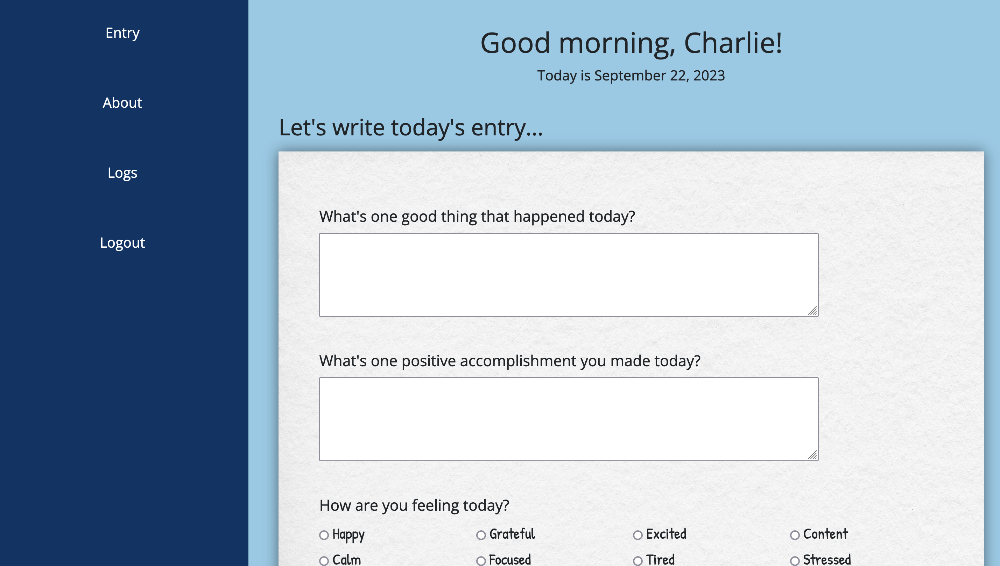

# Gratitude Journal
This is a web app where users can sign up and make daily journal entries

[Live Demo](https://gratitude-journal-la8p.onrender.com/)

## How It's Made:

**Tech used:** HTML, CSS, JavaScript, MongoDB, EJS, Mongoose, Express, Node.js

This project uses an express and mongoDB backend to handle requests and store the entries and users. For the frontend, it uses EJS to generate the views for the user.

## Optimizations

In the future, I would like to add options for the user to select different difficulty, categories, and number of questions.
In the future, i would like to add pagination for the entries page, I would also like to add more features to make it compelling for the users to make their daily entry.

## Lessons Learned:

This project is helping me get a better understanding of how to make full-stack projects and how both the frontend and backend come together. it also helped me organize code with many files and folders using the MVC structure.

